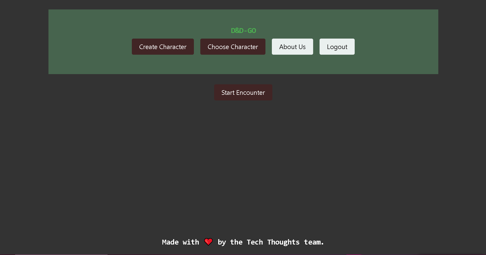
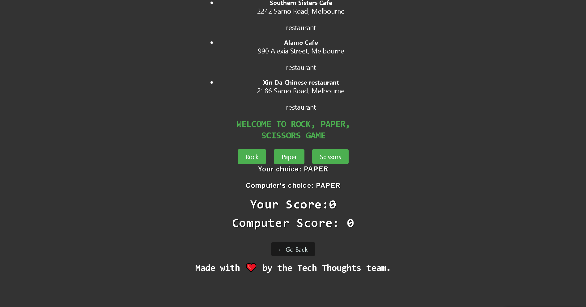
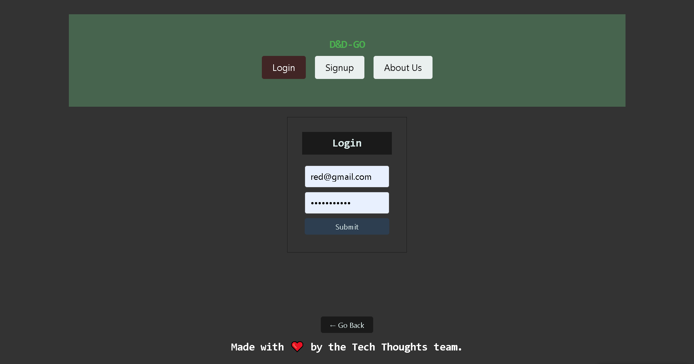

<div align="center">

  <!-- Add badges using the following format: -->
  <!-- (urlToGithubHere) -->

[](https://opensource.org/licenses/MIT)
[](https://github.com/Aricoria10/DnD-GO/graphs/contributors)
[](https://github.com/Aricoria10/DnD-GO/network/members)
[](https://github.com/Aricoria10/DnD-GO/stargazers)
[](https://github.com/Aricoria10/DnD-GO/issues)

</div>

<!-- PROJECT LOGO -->

<div align="center">
  <a href="https://github.com/Aricoria10/DnD-GO">
    
  </a>
  
  <h3 align="center">DnD-GO</h3>

  <p align="center">
    Social media app for the bookworm community to connect with each other and share book recommendations.    <br />
    <a href="https://github.com/Aricoria10/DnD-GO"><strong>Explore DnD-GO Docs »</strong></a>
    <br />
    <br />
    <!-- !!!IMPORTANT!!! add your deployment link here -->
    <a href="https://github.com/Aricoria10/DnD-GO">View Demo</a>
    ·
    <a href="https://github.com/Aricoria10/DnD-GO/issues">Report Bug</a>
    ·
    <a href="https://github.com/Aricoria10/DnD-GO/issues">Request Feature</a>

  </p>
</div>

<!-- TABLE OF CONTENTS -->
<details>
  <summary>Table of Contents</summary>
  <ol>
    <li>
      <a href="#about-the-project">About The Project</a>
      <ul>
        <li><a href="#built-with">Built With</a></li>
      </ul>
    </li>
    <li>
      <a href="#getting-started">Getting Started</a>
      <ul>
        <li><a href="#installation">Installation</a></li>
      </ul>
    </li>
    <li><a href="#usage">Usage</a></li>
    <li><a href="#roadmap">Roadmap</a></li>
    <li><a href="#contributing">Contributing</a></li>
    <li><a href="#license">License</a></li>
    <li><a href="#contact">Contact</a></li>
    <li><a href="#acknowledgments">Acknowledgments</a></li>
  </ol>
</details>

<!-- ABOUT THE PROJECT -->

## About The Project

This application is designed for the dungeons and dragons community to gather and connect. D&D-GO is an immersive game inspired by Dungeons & Dragons. By defeating monsters, players earn experience points to level up and unlock new abilities, facing greater challenges and discovering rare creatures,they can create. D&D-GO has a thrilling adventure around every corner.

Login or Create an Account


Start an Encounter


Play Rock, Paper, Scissors Game


<!--  -->

### Built With

<div align="center">
This project was built using Mongoose, Express, React, Node.

<!-- TODO -->

[](https://javascript.info/)
[](https://nodejs.org/en/)
[](https://expressjs.com/)
[](https://www.npmjs.com/)
[](https://code.visualstudio.com/docs)

</div>

<!-- GETTING STARTED -->

## Getting Started

Once completely built, this application will function as a deployed app on BCS

### Local Installation / Testing

1. Clone the rep

```
git clone https://github.com/Aricoria10/DnD-GO.git
```

2. Install dependencies

```
npm run install
```

3. Seed the database

```
npm run seed
```

4. Launch the app in development environments

```
npm run develop
```

5. Visit:

[localhost://]()
<!-- USAGE EXAMPLES -->

## Usage

Once the app is functional, screenshots will be added in this section.

<!-- ROADMAP -->

## Roadmap

#### MVP

<!-- This is a nested check-box that displays a nice checked or unchecked list on your Github repo to show your visitor's a quick road map! -->

- [x] Front End

  - [x] User Auth
  - [x] User Profile Page
    - [x] Routing
    - [x] Styling
  - [x] Landing Page
    - [x] Routing
    - [x] Styling

- [x] Back End
  - [x] Models
  - [x] Seeds
  - [x] apiRouting
  - [x] userRouting

#### Future Development

- [ ]  Aim to introduce character customization features, allowing players to personalize their avatars
- [ ] Implement exciting new challenges to elevate the gameplay and provide players with fresh obstacles to overcome

See the [open issues](https://github.com/Aricoria10/DnD-GO/issues) for a full list of proposed features (and known issues).

<!-- CONTRIBUTING -->

## Contributing

Contributions are what make the open source community such an amazing place to learn, inspire, and create. Any contributions you make are **greatly appreciated**.

If you have a suggestion that would make this better, please fork the repo and create a pull request. You can also simply open an issue with the tag "enhancement".
Don't forget to give the project a star! Thanks again!

1. Fork the Project
2. Create your Feature Branch (git checkout -b feature/Enhancements)
3. Commit your Changes (git commit -m 'Add some Enhancements')
4. Push to the Branch (git push origin feature/Enhancements)
5. Open a Pull Request

<!-- LICENSE -->

## License

This project is licensed under the MIT license.

See LICENSE.txt for more information.

<!-- CONTACT -->

## Contact

<!-- Add your name, portfolio link, and email if you would like here -->

[Altheia Bentley](https://github.com/Aricoria10) 

[Jazmin Nova](https://github.com/Jazminnova) 

[Ashley Nord](https://github.com/a-nord) 

Project Links:

[Github Repository](https://github.com/Aricoria10/DnD-GO)

<!-- !!!IMPORTANT!!! add your deployment link here -->

[Deployment](https://dnd-go.onrender.com)

<!-- ACKNOWLEDGMENTS -->

## Acknowledgments

Built with Love from the Team!❤️
